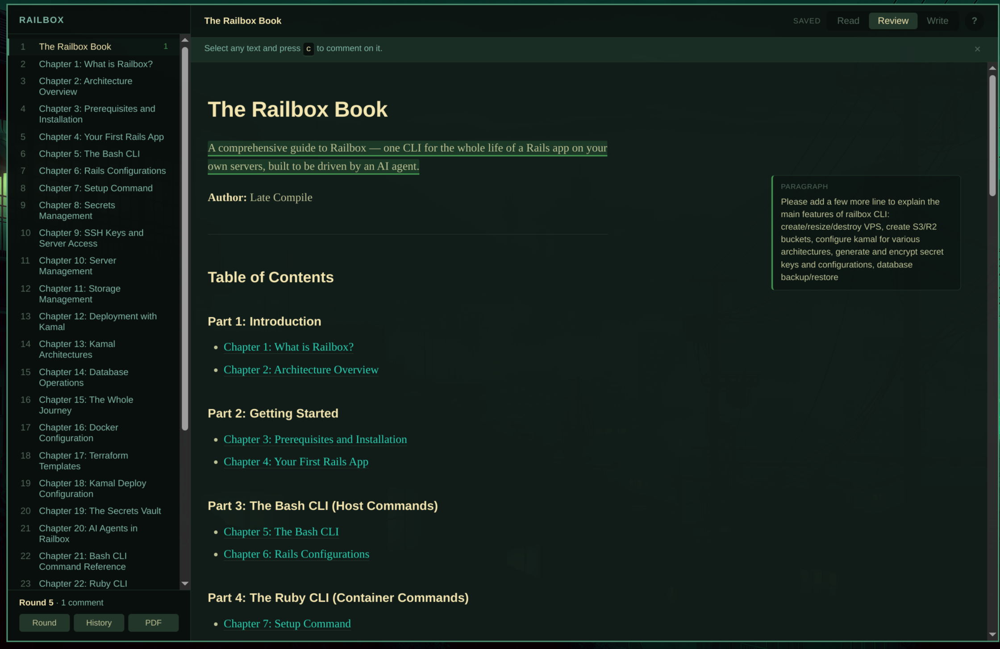

# Galley

A review loop for books written in Markdown.



Agents write Markdown. Humans read PDFs. The feedback in between usually
happens in a chat window, by hand, one paragraph at a time. Galley closes that
loop: read the book, mark up what's wrong, hand the whole markup to an agent,
read it again.

```
  ┌──────────────────────────────────────────────────────┐
  │                                                      │
  ▼                                                      │
 read  ──►  mark up  ──►  dispatch  ──►  agent rewrites  ─┘
```

One pass around that circle is a **round**.

- [doc/ARCHITECTURE.md](doc/ARCHITECTURE.md) — how it is built
- [doc/ROUNDS-AND-GIT.md](doc/ROUNDS-AND-GIT.md) — how diffs work, and how to set your book up
- [doc/ROADMAP.md](doc/ROADMAP.md) — what is next

## Build

A Linux desktop application. It follows the Omarchy theme when there is one
and looks after itself when there is not; nothing else about it is
Omarchy-specific.

Needs `g++`, `make`, Qt6 (`qt6-base`, `qt6-webengine`, `qt6-webchannel`),
`md4c` and `tomlplusplus`. All are in the Arch repos.

```sh
make
./galley ~/path/to/book
```

`galley` with no argument opens the current directory if it is a book you have
opened before, otherwise the book you had open last, otherwise it asks. Naming
a directory is what makes Galley adopt it: a folder is only imported when you
say so, never because a launcher happened to start in one.

To install it for yourself — binary, desktop entry and icon, no root:

```sh
make install PREFIX="$HOME/.local"
```

That puts `galley` in `~/.local/bin` and the entry and icon under
`~/.local/share`, so it appears in the application menu. Or system-wide:

```sh
sudo make install
```

`make uninstall` with the same `PREFIX` removes what was installed. It leaves
`~/.config/galley` and each book's `.galley` directory alone — those are
yours, not the package's.

Arch packaging lives in [`packaging/`](packaging/README.md): `PKGBUILD` tracks
the tip of the repository, `PKGBUILD.release` builds a tagged version.

## The project file

On first open Galley writes `.galley/project.toml` into the book and never
writes it again — from then on it is yours to edit.

```toml
name = "Railbox"

spine = [
  "README.md",
  "part1-introduction",
  "part2-getting-started",
]

references = ["../lib", "../bin"]

[agent]
default = "claude"
```

`references` is material outside the book that the agent should consult — the
source it describes, a spec, an issue. Every dispatch carries the list, whole.
Edit it here, or in the round view under **Book references**; Galley rewrites
only that array and leaves the rest of the file, comments included, alone.
Per-comment references are separate and apply only to their own comment.

`spine` is the reading order. A directory expands to its `*.md` sorted
alphabetically, so the spine fixes the order of the parts while chapters
within a part order themselves. A file is taken as itself.

**Where the order comes from on first open**, in this order of preference:

1. **A build script.** Galley looks for `build-pdf.sh`, `build.sh` and
   `Makefile`, and reads the list out of a `for path in … do` loop — the shape
   a pandoc book build almost always has. It borrows the order and nothing
   else; it does not run the script.
2. **Alphabetical.** Loose `*.md` files first with `README.md` hoisted to the
   front, then each directory. This is a guess, and Galley says so when it has
   made one.

The name comes from `title:` in `metadata.yaml` if there is one, and from the
directory otherwise.

If neither fits your book, edit the spine. It is a plain list and Galley will
not touch it again.

## The PDF

`p` renders the book to `.galley/proof.pdf` with Galley's own renderer — no
pandoc, no LaTeX, no Docker, and what comes out is what you just read.

If your book has its own pandoc build, keep using it. That produces the
shippable artefact — title page, table of contents, real typesetting — and
Galley does not compete with it. It simply is not the thing that launches it:
a shell command read from a config file is one Galley would run blind and
could not explain the failures of.

## Using it

| key | |
|---|---|
| `j` `k` | scroll down / up |
| `Ctrl+d` `Ctrl+u` | half page |
| `Space` `⇧Space` | page down / up |
| `gg` `G` | start / end of chapter |
| `h` `l` | previous / next chapter |
| `1`…`9` | jump to chapter |
| `/` | search the whole book |
| `n` `N` | next / previous match |
| `v` | review mode, and back |
| `c` | comment on the selected text |
| `Ctrl+↵` | save the comment |
| `i` | edit this chapter's Markdown |
| `Ctrl+s` | save without leaving write mode |
| `r` | the open round |
| `R` | past rounds |
| `d` | dispatch to an agent |
| `o` | open a different book |
| `p` | render the book to PDF |
| `Esc` | back out one layer |
| `?` | show this list |
| `Ctrl+l` | log pane |
| `q` | quit |

Press `?` at any time for that list.

In review mode, select text and press `c`. Comments collect into the open
round. When you have read enough, press `d`: Galley writes a brief, shows you
exactly what the agent will receive, and runs the agent CLI of your choice in
the book's directory. When it finishes you get a diff and a fresh round.

Press `i` to edit a chapter yourself — fixing a typo through an agent round is
absurd. Leaving write mode saves. If your edit removes the text an open
comment quotes, that comment is marked **stale**: you have almost certainly
just fixed it by hand, so the round view offers to mark it done.

Apart from write mode, Galley never edits your Markdown. It never writes to
git at all.

## Agents

`~/.config/galley/agents.toml`, written on first run from the agent CLIs it
finds on your PATH — so the list is yours, not a guess:

```toml
[claude]
command = ["claude", "-p", "--permission-mode", "acceptEdits", "{prompt}"]
```

`{prompt}`, `{brief}` and `{root}` are substituted. Add whatever CLI you use,
in the same shape; the name is yours to choose.

These run with nobody watching, so an agent that stops to ask permission
cannot be answered — it just reports back having changed nothing. Each profile
therefore grants file editing up front, and no more than that. Where a tool
offers nothing narrower than "allow everything", Galley writes the profile
commented out with the reason rather than quietly granting it.

Installed an agent since? `galley --agents`, or **Rescan** in the dispatch
pane, adds profiles for anything new. Neither ever touches what is already in
the file — so if you do not want an agent offered, comment it out rather than
deleting it, and a rescan will leave it alone.

Which one a dispatch uses: `[agent] default` in the book's `project.toml` if
set, otherwise the agent you chose for the Omarchy desktop, otherwise the
first profile. If your desktop agent is one Galley has no profile for, it says
so rather than silently using a different one.

## Command line

```sh
galley --check BOOK           # render every chapter, report block mapping
galley --blocks FILE BOOK     # list a chapter's top-level blocks
galley --html FILE BOOK       # print a chapter's rendered HTML
galley --brief BOOK           # print the open round's brief to stdout
galley --proof BOOK           # render the book to .galley/proof.pdf
galley --agents               # list agent profiles, adding any newly installed
galley --dispatch BOOK        # send the open round to an agent, from the terminal
galley --dispatch --only c-0001,c-0004 BOOK
galley --dispatch --agent codex BOOK
```

`--dispatch` is the same thing the `d` key does: it writes the brief, runs the
agent in the book's directory, streams the output, and exits with the agent's
exit code. A failed run leaves the round open so you can retry it.

`--check` is the regression test: it asserts that md4c and Galley's own source
scanner agree on how many top-level blocks each file has, which is what makes
source-accurate anchoring possible.
